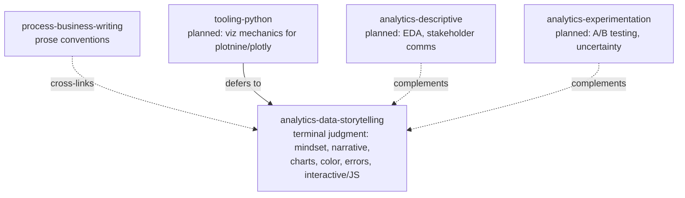

# Analytical Data Storytelling and Visualization

Conventions the agent should apply by default whenever it analyzes data or builds visualizations for human consumption. The goal is data work that is **trustworthy, accessible, narratively coherent, and visually disciplined** — usable in any analytical context from a one-cell exploratory plot to a multi-panel scrollytelling article.

These conventions are vendor-agnostic and tool-agnostic. They are based on the working practices of professional data journalists and on widely cited references in the data-visualization canon (Tufte, Cairo, Knaflic, Wilkinson, Schwabish, Few, Kirk), and on the editorial discipline visible in *The Economist*'s data journalism (its "Graphic Detail" section and "Off the Charts" newsletter, 2022-06 to 2026-04 and ongoing).

## Position in the skill stack

This skill is the **terminal judgment layer** for analytical visualization. It tells the agent *what* to make, *why*, and *what makes it honest*. Tooling-focused skills carry the *mechanics* of how to render it.



There is no separate `tooling-d3-js` or `tooling-plotly` skill planned. JavaScript-specific guidance lives in this skill at [references/07-interactive-and-js-viz.md](references/07-interactive-and-js-viz.md), because the same judgment governs whether to reach for JavaScript at all.

## When this skill applies

Apply by default when the agent works with data destined for a human reader. Common situations:

- Exploring a dataset in a notebook, even before any "chart" exists
- Producing chart code in any language (Python, R, JavaScript, SQL-driven BI tools, spreadsheets)
- Reviewing or critiquing a chart someone else made
- Writing prose that cites numbers, paired with charts
- Designing dashboards, slide decks, blog figures, README plots, scrollytelling pieces
- Building interactive visualizations or special projects (maps, scrollers, explorers)
- Adapting an existing chart for a new medium (print → web → mobile → social → video → presentation)

When in doubt, treat any quantitative artifact destined for a human reader as in scope.

## The seven pillars

The skill covers seven pillars; each has a dedicated reference file. Read the relevant reference when the user's task touches that pillar, or when the agent is producing more than a single throwaway chart.

| Pillar | Reference | Use when |
|---|---|---|
| 1. Data mindset | [references/01-data-mindset.md](references/01-data-mindset.md) | Starting an analysis, deciding what to measure, finding/sourcing data, deciding what data even exists |
| 2. Narrative arc | [references/02-narrative-arc.md](references/02-narrative-arc.md) | Asking what story the data tells, distilling a one-sentence message, structuring an analytical piece (including scrollytelling) |
| 3. Data quality | [references/03-data-quality.md](references/03-data-quality.md) | Cleaning, transforming, joining, sanity-checking data; communicating uncertainty in forecasts, models, polling |
| 4. Chart selection | [references/04-chart-selection.md](references/04-chart-selection.md) | Picking a chart type; adapting a chart for print, mobile, social, video or presentation; composing infographics |
| 5. Visual elements | [references/05-visual-elements.md](references/05-visual-elements.md) | Designing the chart's appearance — color, space, hierarchy, annotations, typography, balance |
| 6. Common errors | [references/06-common-errors.md](references/06-common-errors.md) | Catching honest mistakes, spotting dishonest ones, post-mortems on charts that disappointed |
| 7. Interactive and JS | [references/07-interactive-and-js-viz.md](references/07-interactive-and-js-viz.md) | Deciding whether interactivity earns its cost; building JavaScript visualizations and scrollytelling |

## The four planning questions

Before producing any analytical artifact, answer four questions in one short sentence each. These mirror the planning questions in [process-business-writing](../process-business-writing/SKILL.md), adapted for data:

- **Question.** What decision or understanding does this analysis serve? If you cannot state the question, you are decorating, not analyzing.
- **Audience.** Who will read the chart, and what do they already know? An executive in a hurry, a policy reviewer, a colleague debugging a model, and the public read the same chart very differently.
- **Message.** If the reader takes away one sentence, what should it be? The chart's title is often a draft of this sentence.
- **Form.** What chart type, layout and medium best carry that message to that audience?

If the agent cannot answer any of these in one sentence, planning is not done. Ask the user, or make a defensible assumption and flag it.

## Workflow the agent applies

For any non-trivial analytical artifact (anything beyond a one-line debugging plot), follow this loop:

1. **Look at the raw data first.** Open the file, scroll the rows, read the documentation, pull a `head` and a `describe` or equivalent. Note what is missing, what is mistyped, what is suspicious. See [01-data-mindset.md](references/01-data-mindset.md) and [03-data-quality.md](references/03-data-quality.md).
2. **Orient with the simplest possible chart.** A bar, a line, a scatter, a quick map. Resist the urge to design before you have understood. See [04-chart-selection.md](references/04-chart-selection.md).
3. **State the message in one sentence.** If you cannot, the analysis is not done. See [02-narrative-arc.md](references/02-narrative-arc.md).
4. **Try to disprove the message.** Pick the chart that would falsify your story. If it doesn't, the story is stronger.
5. **Choose the chart that fits the question, audience and medium.** Default to bar, line and scatter unless the data resists. See [04-chart-selection.md](references/04-chart-selection.md).
6. **Design the chart.** Apply the visual-elements conventions: limited palette, clear hierarchy, deliberate annotations, no decoration that does not earn its space. See [05-visual-elements.md](references/05-visual-elements.md).
7. **Audit for common errors.** Run through the checklists in [06-common-errors.md](references/06-common-errors.md). Have a colleague — or, in their absence, a fresh-eyes pass — read the chart cold and tell you what it says.
8. **Adapt for the medium.** The same chart for print, web, mobile, social and video is rarely the same chart. See the adaptation guidance in [04-chart-selection.md](references/04-chart-selection.md).
9. **Decide whether interactivity earns its cost.** Most charts should not be interactive. See [07-interactive-and-js-viz.md](references/07-interactive-and-js-viz.md).

For exploratory analysis (steps 1–4 only, in a notebook, for the agent's own eyes), collapse to a quick loop: look, plot, name the message, falsify. The bar for visual polish is low; the bar for honesty is the same.

## Defaults the agent applies to all analytical work

These cross-cutting defaults override local stylistic instincts unless the user or the project explicitly asks for a different register.

### Mindset

- **Data is empirical evidence, not truth.** It points; it does not pronounce. Pair it with reasoning, intuition and other inputs before recommending a decision.
- **There is no such thing as raw data.** Every dataset is a curated artifact with choices baked in. Note the choices.
- **There is no such thing as clean data.** Budget time for cleaning; expect 50–90% of the work to live there.
- **Have an adversarial relationship with your hypothesis.** Try to disprove it before publishing it.
- **Ask, "for whom does this fail?"** Every metric, model and chart has populations it serves badly. Find them before someone else does.

### Narrative

- **Lead with the message, not the method.** Most readers want the answer; the curious dig for the method.
- **A chart is a visual argument, not a self-explanatory image.** Treat its title, subtitle, annotations and axis labels as the prose that makes the argument.
- **The chart's title is a sentence.** Either descriptive ("Annual revenue by segment, 2015–2024") or — preferred when the data carries news — a takeaway sentence ("Revenue from the cloud segment overtook hardware in 2022").

### Charts

- **Default to bar, line and scatter.** Together they answer most analytical questions. Reach for fancier forms — bubble, treemap, ridgeline, ternary, beeswarm, sankey, slope, bump — only when the simpler chart genuinely fails.
- **Never break a bar-chart axis.** The bar's length encodes the value; truncating it lies. If an outlier dominates, let it dominate, or switch to a different chart.
- **Line-chart axes can start above zero,** but mark the break and leave room below the lowest point.
- **Use as few colors as possible.** Six is a soft ceiling; many good charts use one or two. Pick a palette and reuse it consistently across a piece.
- **Show all the data when feasible.** Background lines in grey, the few series of interest in color. Distributions over single summary statistics.
- **Annotate.** Inflection points, era markers, and surprising values deserve a label on the chart, not in the body text.

### Tool stack escalation

For analytical visualization, escalate from simple to complex only when the simpler tool genuinely cannot do the job:

1. **`plotnine` (Python) or `ggplot2` (R) for static, publication-quality charts.** Default for reports, slides, README figures, blog plots.
2. **`plotly` (Python) for lightweight web interactivity.** Default for notebooks where hover labels, zoom or pan add real value, and for dashboards.
3. **JavaScript (Observable Plot, Vega-Lite, D3, often with Svelte and Scrollama) for advanced custom interactivity, scrollytelling, and bespoke web pages.** Reserved for cases where the simpler tools cannot deliver the experience the audience needs.

The choice of tool does not change the judgment in this skill; the same conventions on color, scale, annotation, hierarchy and ethics apply regardless of which tool draws the pixels. Full small examples for each layer live in [07-interactive-and-js-viz.md](references/07-interactive-and-js-viz.md).

### Numbers and uncertainty

- A number in isolation rarely informs. Pair it with a baseline, a comparison, or a vivid analogy.
- Distinguish **percentage** from **percentage points** explicitly. They are not synonyms.
- Distinguish **relative** from **absolute** change. "Risk doubled" can mean a tiny absolute change or a large one.
- Show **uncertainty** when it is meaningful: confidence intervals on forecasts, polling averages with their constituent polls in the background, modeled curves with their plausible bands. A single line implies false precision.
- Watch for **Simpson's paradox**: a trend within groups can vanish or reverse when groups are aggregated. Plot both views before claiming either.
- Watch for **the base-rate fallacy**: the absolute count of an outcome in a subgroup is not the rate. Use shares, not counts, when the underlying populations differ.

### Accessibility

- Avoid red+green pairings; many readers cannot distinguish them.
- Choose colors that differ in **more than hue** (also in lightness or saturation) so they survive grayscale and color-vision deficiencies.
- Combine color with a second cue (line style, marker shape, direct labeling) so color is never the only carrier of meaning.
- Test charts on a small screen, not just the design canvas. Most readers are on phones.

### Cross-cultural awareness

- Color carries cultural meaning that does not travel uniformly. Red reads as "loss" or "danger" in many financial contexts but as "auspicious" in much of East Asia. When the audience is global, pick palettes that lean on lightness rather than culturally loaded hues, and explain conventions in the legend or annotation.
- Map projections are political. Disputed borders, choice of projection, and labeling all carry editorial weight. See the maps subsection in [04-chart-selection.md](references/04-chart-selection.md).

### Spelling and locale

- **Default to American English** in chart titles, labels and prose ("color" not "colour", "labor" not "labour", "analyze" not "analyse"), in line with the user's working default in [process-business-writing](../process-business-writing/SKILL.md). This is **not a hard rule**; honor an explicit override (e.g., a UK-based publication or an existing document in British spelling), and never mix locales within a single artifact.

## Output templates

The agent should adopt these compact templates when the task fits.

### Chart title pattern

For most analytical charts, prefer a two-line title:

```
[Headline takeaway sentence]
[Descriptive subtitle: the metric, units, geography, time window]
```

Example:

```
Revenue from the cloud segment overtook hardware in 2022
Quarterly revenue, $bn, FY2015–FY2024 (Acme Corp.)
```

When the chart is exploratory or the takeaway is genuinely uncertain, drop the headline and use a single descriptive title:

```
Quarterly revenue by segment, $bn, FY2015–FY2024 (Acme Corp.)
```

### Chart caption / footnote block

Below every chart that will leave the analyst's screen:

```
Source: [primary source, with date accessed]
Note: [definitions, scope, calculations that the chart hides]
```

When estimates or forecasts are involved, name them: "*Forecasts shown as dashed lines.*"

### Analytical write-up

```
# [Title — what changed or what to decide]

## TL;DR
[One to three sentences with the headline finding.]

## What we measured
[The question, the data, the time window, and what we left out.]

## What we found
[The body, with charts inline, each carrying a takeaway title.]

## Caveats
[What this analysis cannot tell you. What would change the answer.]

## Recommendation / Next step
[A specific action, owner, and date when applicable.]
```

## Anti-patterns

These show up frequently in AI-assisted analytical work. Reject them on sight.

- **Chart soup.** Producing five charts when one would do. Each chart should answer one question; if it doesn't, cut it.
- **Default-style charts.** Shipping the matplotlib / Excel / Tableau default look, with a default palette and no title sentence. Defaults are debugging plots, not deliverables.
- **3D anything for analytical purposes.** 3D bar charts, 3D pie charts, 3D scatter plots almost always distort comparison.
- **Pie charts with more than three slices,** or two pie charts compared side by side. Use bars.
- **Bar charts with broken or zoomed axes.** This is the single most common deceptive chart.
- **Dual y-axes with arbitrary scales** that visually imply correlation between unrelated series.
- **Color used decoratively** rather than to encode a variable.
- **Rainbow palettes** for ordinal data (use a perceptually uniform palette such as viridis or a single-hue gradient instead).
- **Interactivity for its own sake.** Tooltips that hide essential information; sliders no one will move; "explore the data" buttons with no path through the data.
- **Print-only thinking.** Designing a wide landscape chart with annotations on the right margin without checking what it looks like on a 360px-wide phone.
- **Numbers without anchors.** Citing percentages without baselines, growth rates without windows, totals without currencies, dates without timezones.
- **The neutrality fallacy.** Believing that a chart "just shows the data". Every chart is the result of editorial choices. Own them.

## Interaction with other skills

- **[process-business-writing](../process-business-writing/SKILL.md)**: governs the *prose* around charts (titles, captions, body text, executive summaries). This skill governs the *charts and analysis* themselves. Both apply when writing an analytical piece. The lighter-weight section [`process-business-writing/references/05-data-storytelling.md`](../process-business-writing/references/05-data-storytelling.md) is intended for general business prose; this skill is the deeper, dedicated home for analytical work.
- **[process-git](../process-git/SKILL.md)**: governs commits and PR hygiene around analytical artifacts (notebooks, charts, dashboards).
- **`tooling-python`** (planned): when present, it will carry mechanics for `plotnine`, `plotly`, `pandas`/`polars`, Jupyter, etc. It defers to this skill for *what* to make and *why*. There is no planned dedicated `tooling-d3-js` or `tooling-r` skill; advanced JavaScript visualization guidance is consolidated in [references/07-interactive-and-js-viz.md](references/07-interactive-and-js-viz.md).
- **`analytics-descriptive`** (planned): when present, it will carry the methodological layer for exploratory analysis, dashboards and stakeholder communication. It defers to this skill for visualization judgment.
- **`analytics-experimentation`** (planned): when present, it will carry power analysis, A/B test design and statistical inference. It defers to this skill for how to communicate experimental results visually.

## Quality checklist for the agent

Before delivering any analytical artifact, verify:

- [ ] Question, audience, message and form are answerable in one sentence each.
- [ ] The dataset has been inspected in raw form; missing values, outliers and definitional quirks are noted.
- [ ] The chart's title states the takeaway in a sentence, or — when the chart is exploratory — names the metric, units, geography and time window.
- [ ] No bar chart has a non-zero baseline; line-chart axis breaks are clearly marked.
- [ ] Comparisons use comparable units, time windows, and definitions.
- [ ] Color usage is justified, limited (≤ ~6 hues), accessible, and consistent across the piece.
- [ ] Annotations highlight what matters; nothing else competes for attention.
- [ ] The chart has been previewed on a small screen if it might be read on one.
- [ ] Sources, notes, caveats and forecasts are explicitly labeled.
- [ ] Interactivity, if present, earns its cost (extra information, exploration, or scrollytelling explanation) — not "because we could."
- [ ] A reader who has not seen the data can describe the chart's takeaway in one sentence.
- [ ] American English is used consistently (or the locale override is applied throughout).

## References

The conventions in this skill draw on widely available, primary-source data-visualization references. Consult them when deeper grounding is needed:

- Edward Tufte, *The Visual Display of Quantitative Information*; *Envisioning Information*; *Visual Explanations*. Foundational on chart honesty and information density.
- Alberto Cairo, *The Truthful Art* (2016) and *How Charts Lie* (2019). Ethics, decoding, and common errors.
- Cole Nussbaumer Knaflic, *Storytelling with Data* (2015). Practical conventions for business charts.
- Andy Kirk, *Data Visualisation: A Handbook for Data Driven Design* (2nd ed., 2019). Workflow-oriented and tool-agnostic.
- Jon Schwabish, *Better Data Visualizations* (2021), and the Graphic Continuum (with Severino Ribecca) for chart-type taxonomy.
- Stephen Few, *Show Me the Numbers* and *Now You See It*. Dashboard and quantitative-display conventions.
- Leland Wilkinson, *The Grammar of Graphics* (2005). The conceptual basis for `ggplot2`, `plotnine` and Vega-Lite.
- Hadley Wickham, *ggplot2: Elegant Graphics for Data Analysis* (3rd ed., online). The grammar of graphics in practice.
- Claus O. Wilke, [*Fundamentals of Data Visualization*](https://clauswilke.com/dataviz/) (2019, free online). Modern, opinionated, R-focused but tool-agnostic.
- Kieran Healy, [*Data Visualization: A Practical Introduction*](https://socviz.co/) (2018, free online).
- Tim Harford, *The Data Detective* (US) / *How to Make the World Add Up* (UK) (2020). Statistical literacy and common reasoning errors.
- Cathy O'Neil, *Weapons of Math Destruction* (2016). Algorithmic harm and the "for whom does this fail" question.
- David Spiegelhalter, *The Art of Statistics* (2019). Communicating uncertainty.
- Caroline Criado Perez, *Invisible Women* (2019). On who is missing from the data.
- Sandra Rendgen and Julius Wiedemann (eds.), *History of Information Graphics* (2022). Historical canon.
- The Economist, [*Off the Charts*](https://www.economist.com/newsletters) newsletter, 2022-06-07 to present (issues sampled through 2026-04-21 in distilling this skill). Working examples of the conventions above; the issues on JavaScript visualization (2022-12-06), interactivity decisions (2023-03-21), special projects (2024-08-06), color (2022-09-20, 2024-06-11), maps (2023-09-19, 2024-03-19, 2024-10-29), chart selection (2024-03-12), common pitfalls (2025-04-29) and chart adaptation across media are particularly relevant.
- The Economist, ["Mistakes, we've drawn a few"](https://medium.economist.com/mistakes-weve-drawn-a-few-8cdd8a42d368), 2019. Public post-mortem of design errors.
- Sondre Solstad and colleagues, *The Economist*'s methodology pages on its excess-deaths model, election forecasts and political-unrest model. Examples of communicating modeled uncertainty.
- [Anthropic Agent Skills](https://github.com/anthropics/skills) — the skill format this document follows.
